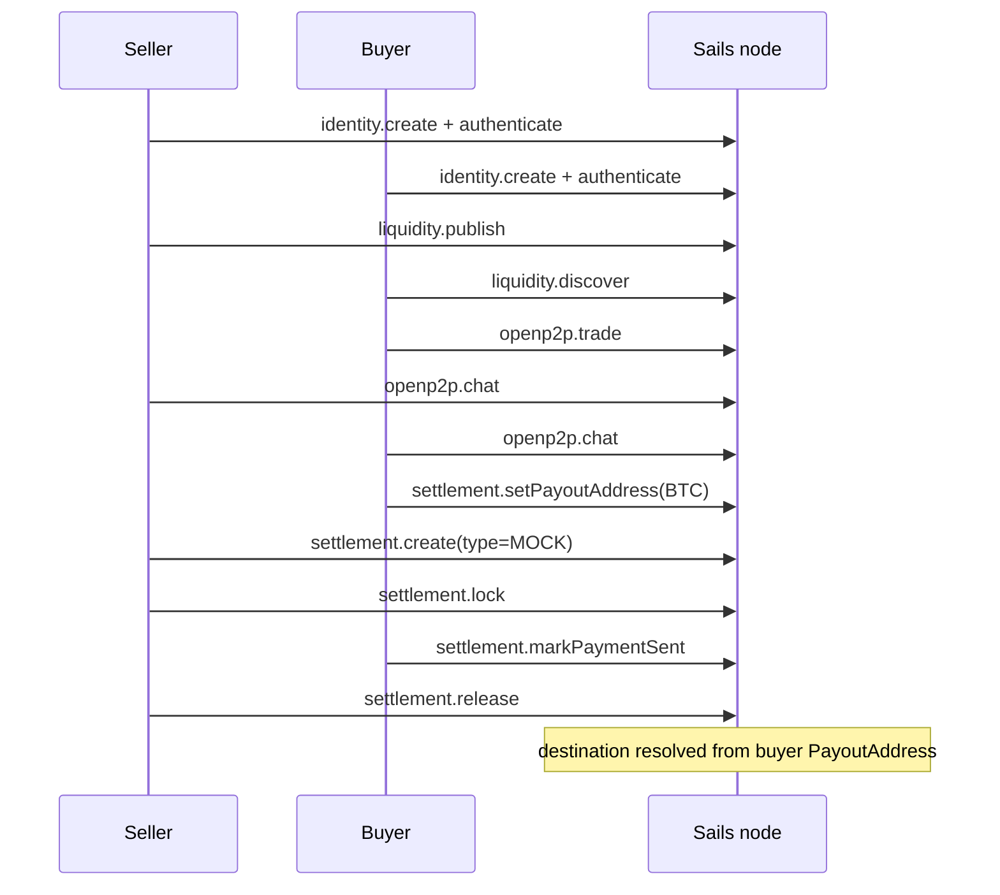

# Architecture

This repository is an external consumer of the published Sails SDK family.

## Stack

```text
Next.js app / standalone examples
  └─ @satsails/sdk-react@0.2.0
       └─ @satsails/p2p-trading-sdk@0.2.0
            └─ @satsails/p2p-schemas@0.2.0
                 └─ HTTP + WebSocket
                      └─ compatible Sails node
```

The starter contains no protocol implementation and no workspace link back to
the Sails Protocol monorepo.

## Public browser path

The Next.js page uses:

```text
SailsProvider
→ useSailsClient()
→ client.liquidity.discover()
→ public offer summaries
```

This is deliberately a public read.

Trade/escrow reads are not modeled as public in the UI because SDK 0.2.0
requires authenticated, authorized sessions for those surfaces.

## Authenticated P2P example

`examples/p2p-bitcoin-trade.ts` uses two separate `SailsClient` instances:



`MOCK` is explicit because BTC without a type selects the real MULTISIG
provider in 0.2.0.

## Arbitration example

`examples/escrow-with-arbitration.ts` adds:

```text
buyer dispute
→ assigned arbiter
→ canonical authority decision
→ local arbiter signature
→ resolveDisputeWithWallet()
→ settlement outcome
```

The private signing key remains local to the demo arbiter.

## Boundaries

- The starter does not own protocol truth.
- The React package does not bypass SDK authorization.
- Workspace success in Sails Protocol does not prove this repository works.
- This repository's CI is the external-consumer proof against npm artifacts.
- Fake settlement and fake wallet helpers are labeled and must not be
  interpreted as real-funds proof.
