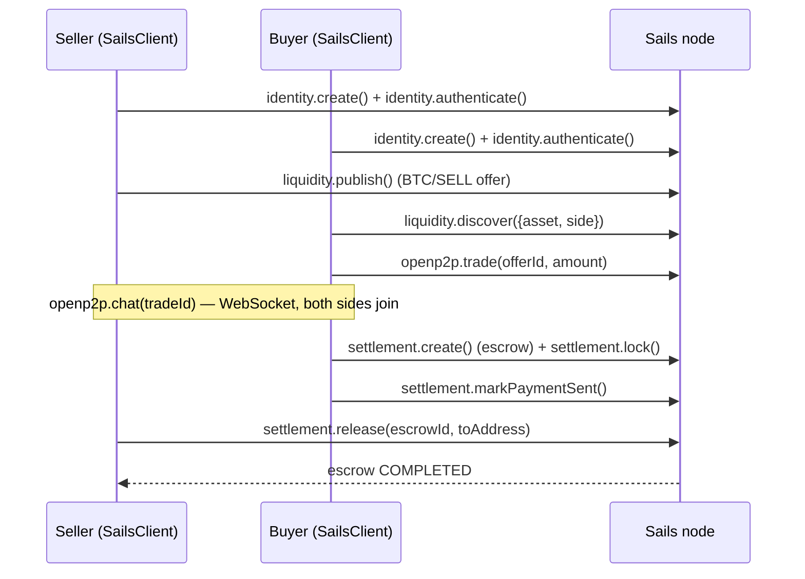
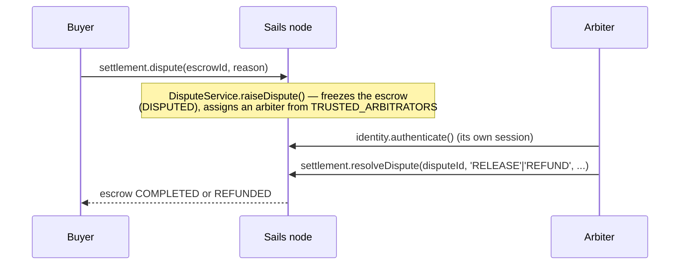

# Architecture

How this starter's pieces actually connect — verified against the real
source in this monorepo, not aspirational.

## The stack

```
Next.js app (this starter)
  └─ @satsails/sdk-react   — hooks/components (SailsProvider, useSailsTrade, TradeCard, ...)
       └─ @satsails/p2p-trading-sdk    — SailsClient (identity/liquidity/openp2p/settlement/reputation/peers)
            └─ fetch (HTTP) + WebSocket
                 └─ Sails node (src/main.ts) — Fastify routes, one module per protocol primitive
                      └─ Postgres (Prisma) + Redis (sessions, challenges, pub/sub)
```

`@satsails/p2p-trading-sdk` is the only thing that talks to the network. `@satsails/sdk-react`
is a thin React layer on top of it (TanStack Query for caching/mutations),
and this starter's own `src/sails-integration/` files are a thin layer on
top of *that* (a lazy client singleton, a couple of typed helpers) — no
new protocol logic exists in this starter.

## Golden path: a P2P trade end-to-end

The sequence `examples/p2p-bitcoin-trade.ts` actually runs, start to
finish, against a live local node:



Every arrow above is a real HTTP call (`SailsTransport`, `packages/sails-sdk/src/transport.ts`)
except the chat step, which opens a real WebSocket (`openp2p.chat()`
returns a `WebSocketChannel` — `onMessage`/`send`/`close`, not a REST call).

## Dispute/arbitration path

`examples/escrow-with-arbitration.ts` exercises the escalation path
(RFC-007 D4) on top of the same golden path, once the trade is in
`PAYMENT_PENDING`:



The arbiter is a *separate* authenticated `SailsClient` session — not a
protocol role, not special-cased server-side beyond "is this
participantId in `TRUSTED_ARBITRATORS`." See that script's own header
comment for the real one-time setup step this requires on a fresh node.

## Why the Next.js app doesn't reuse `TradeCard` for offers

`liquidity.discover()` returns `LiquidityOfferSummary[]` (id, asset,
side, priceUsd, paymentMethods, ...) — a different shape from `Trade`,
which is what `TradeCard` actually renders. The starter's "Discover
offers" section renders plain rows for that reason; `TradeCard` is used
only in "View a trade," which is backed by the real `Trade` type via
`useSailsTrade()`. Forcing one component to accept two unrelated shapes
would need a fabricated adapter — not done here.

## What this starter deliberately does not do

- No bundler/build step for the two `examples/*.ts` scripts — plain
  `ts-node --transpile-only`, matching `examples/simple-wallet`'s own
  precedent.
- No state management library beyond TanStack Query, already pulled in
  by `@satsails/sdk-react`.
- No custom WebSocket reconnect/backoff logic — `openp2p.chat()`'s
  `WebSocketChannel` is used as-is.
